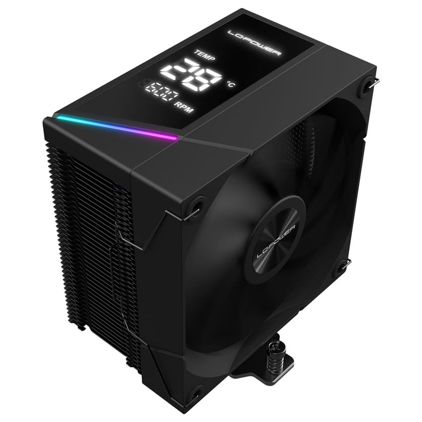

# LC-Power DIGI-Display
Control DIGI Series of CPU coolers from manufacturer LC-Power.

    
     
    <small>This image is courtesy of <a href="https://www.lc-power.com/" target="_blank">LC-Power.com</a> and is subject to their copyright terms. You can access the official image material via this <a href="https://www.lc-power.com/wp-content/uploads/2024/03/Icon-Bildmaterial.zip-Datei.png" target="_blank">image material archive</a>.</small>

|                |                                                                                                                                                                                 |
|----------------|---------------------------------------------------------------------------------------------------------------------------------------------------------------------------------|
| **Product:**   | [LC-CC-120-DB6 – DIGI Serie](https://www.lc-power.com/lc-cc-120-db6/)                                                                                                           |
| **Datasheet:** | [EN](https://www.lc-power.com/wp-content/uploads/2025/06/LC-CC-120-DB6_datasheet.pdf) \| [DE](https://www.lc-power.com/wp-content/uploads/2025/06/LC-CC-120-DB6_Datenblatt.pdf) |

### Features
- [x] Set Temperature (from `0 - 99`)
- [x] Set RPM (from `0 - 9999`)
- [ ] Settings UI
- [ ] Adding CPU & GPU Monitoring

### Currently under development/reverse engineering
- [ ] Change Temperature from `°C` to `F`
- [ ] Enable/Disable LCD-Segments (Logo, Temp, RPM,..)
- [ ] Change LCD-Brightness

## Screenshot

